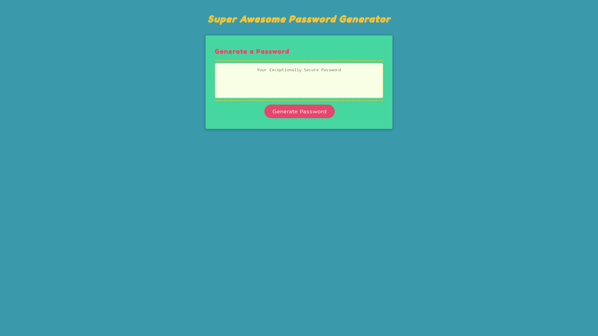

# Super-Awesome-Password-Generator

---

## Description

<ul>
    <li>For this project my goal was to create a random password generator.</li>
    <li>The UI provides a clean, and fun user experience.</li>
    <li>This was my first project to feature Javascript. The hardest part for me was knowing where to start.
        Once I got started, everything began to make sense and was easier for me to visualize the how the code works.</li>
</ul>

---

## Technologies Used

<ul>
    <li>HTML</li>
    <li>CSS</li>
    <li>Javascript</li>
</ul>

---

## Link
https://mahiv87.github.io/Super-Awesome-Password-Generator/

---

## Mock-up

---
